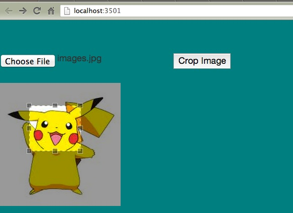
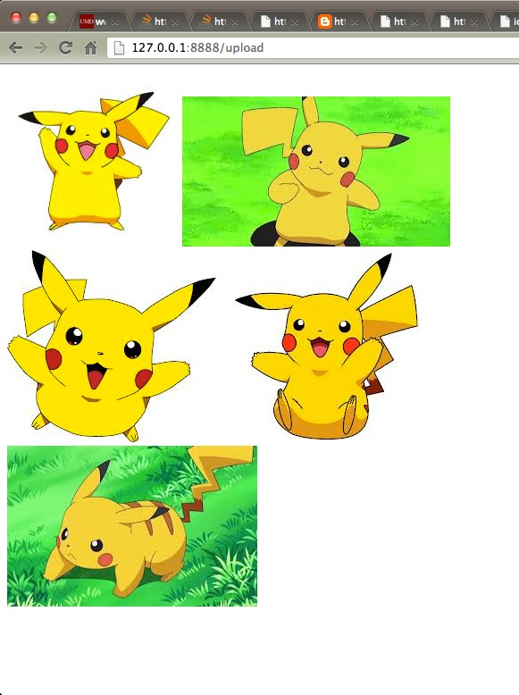

###V1.0 

###TO-DO 

----
- Algorithm optimization
	- image descriptor 
	- ....
	
- use openCV to solve  
	- ~~SURF algorithm ~~
    - ~~k-nearest neighbor algorithm ~~
	 
- ~~pHash algorithm ~~
    - ~~understanding DFT , DCT ... ~~

- interface  
   - upload image and select the part that interests the user for searching 