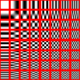

# 一些尝试
### 课题名称
图像搜索

------

### 关于现有的部分图像搜索方法的情况

#### Ahash ( average hash )
**对一张图片基本处理步骤:**

- 缩放图片
- 转化成灰度图像
- 计算灰度平均值，转成2值图像
- 根据自定义规则( e.g hamming distance )，生成描述该图像的hash值

*对比不同图像生成的hash值，最接近的hash值最有可能相似*

**分析:**

此算法速度快，但是针对的图片基本上只有缩放，明度、颜色变化的简单变化

----
#### Phash

**算法overview:**

phash本质上跟ahash是相似的，属于对ahash的扩展，在转化成灰度图像后，
经过DCT转化将图像化成不同的频率域表示

为了提升计算速度，再适度减少上一步骤的矩阵的规模，接着如同ahash一般，  
计算这个shrink矩阵的平均值，再将此值作为阈值，将其转化成二值矩阵，最后  
根据自定义的规则生成该图像的hash值

**分析:**
速度较ahash慢，但因其是根据频率域分析图像，对于更多简单的图像变化，如旋转，覆盖瑕疵等都有较好的搜索效果

----
#### SIFT
- 将图像划分成不同尺度空间，为了在不同缩放程度下能辨别图像特征集
- 寻找关键点
	- 利用高斯模糊去除图像的细节,计算几个梯度的高斯模糊图像，为了在不同视距下辨别图像特征集
	- 计算同一尺度不同梯度高斯模糊图像的差别，相对拉普拉斯算子的速度快
	- 利用上面所计算的差别图像，以几个为一组，计算最大值与最小值
	- 进一步减少关键点的个数(根据对比度，关键点是否存着于边缘等) 
	
### ### SURF
